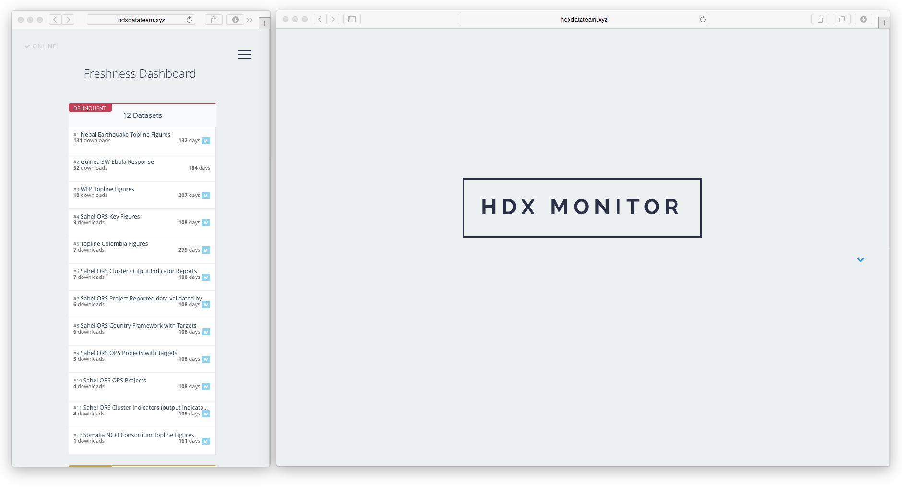

## HDX Monitor Server
Helps organize the micro-services that make the HDX Monitor.

## Docker

This image can be run by itself, however many of its features will fail to work. Please refer to the `docker-compose.yml` file in the [HDX Monitor](https://github.com/luiscape/hdx-monitor) repository for information on how to run this application together with all its supporting services.
